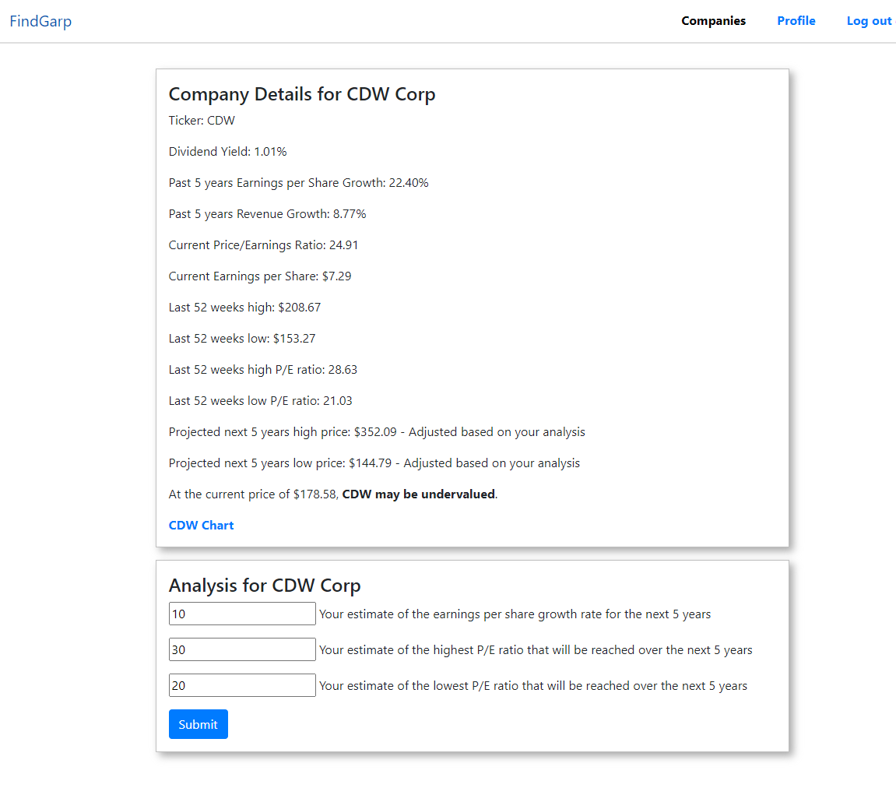

# Find_Garp

## Project Proposal

### Overview

Find_Garp will be an app for finding Growth at a Reasonable Price (GARP) which is a popular method for investors to find stocks to buy. Publicly traded companies in the United States have to file their financial statements quarterly with the Securities and Exchange Commission (SEC). The data is available from the SEC and also from some companies that extract the data from the SEC website and make it available via an API.

### Proposed company details screen mockup

<!-- markdownlint-disable -->

<!-- markdownlint-restore -->

### Proposed tech stack

- The tech stack will include NodeJS, Express, React, React Router, and Postgres, with Bootstrap for styling.
- The frontend will be React.
- The backend will be NodeJS with Postgres.
- There will be a backend process to keep the database updated.

### Focus

- Find_Garp will be a full-stack application with a database and an API on the back end with a React front end.
- Front end styling will be basic and will make use of React Bootstrap. Nothing fancy, but it may include some charting functionality or a link to charts.

### Website or mobile app?

- Find_Garp will be a website styled with React Bootstrap to be responsive but will be presenting data and may look better on a full size monitor.

### Goals/Objectives

- Users can learn about how to analyze companies' stock data to find potential investing opportunities using the “Growth at a Reasonable Price” (GARP) methodology.

### Target audience

- Anyone interested in learning about how to find growing companies with reasonable stock prices.

### Data and data access strategy

- The starting point for the list of companies to include will be the Vanguard Total Stock Market Index which is available as a mutual fund (ticker: VTSAX) or an exchange traded fund (ticker: VTI). Currently there are 4,060 companies listed in that index.
- There are APIs available with free accounts. Most have limits on usage for the free account.
- Proposed: https://finnhub.io - Limit of 60 API calls per minute with company name, financial data, and previous close prices for stocks.

### Proposed project approach outline

#### Addressing possible issues with the source data API

- I will build the database and an API for the front end to access the database.
- All the data needed by the application will be in the database with the possible exception of the prior day closing prices for stocks which may require a real time API call when a user requests details for a stock. If this becomes an issue I can store a recent price in the database as it is not critical that the price be from the current price of the most recent close.
- An additional back-end process will be required to keep the database updated as companies file quarterly and annual financial statements and as companies are added to the index or merge or go out of business.

#### Securing sensitive information

- A user will be able to create an account, but the only information requested will be username, first and last name.
- No password reset feature will be included. Forgotten passwords must be reset by a db admin.

#### Proposed functionality

- View a list of companies with positive earnings per share growth over the past 5 years.
- Select a company to view financial details about the company including a projection of high and low stock prices expected over the next 5 years.
- Add analysis for a company to adjust the projections, add comments for the analysis, and save the analysis and comments.

#### Proposed user flow

- Register for an account.
- Login/logout.
- View a list of growing companies.
- Add and save analysis and comments for a company if desired.
- View and update previously saved analysis.
- Delete previously saved analysis.
- Delete account.

#### What makes it more than CRUD?

- Users can use the app to learn about the GARP investing methodology and to apply analysis to a company's financials.

#### Nice to have

- Charts and additional tools to help with analysis.
- A help function with tips for using the features of the app and explaining what all the numbers mean.
- Links to other sites where information can be reviewed to help in the analysis.
- Password reset capability
